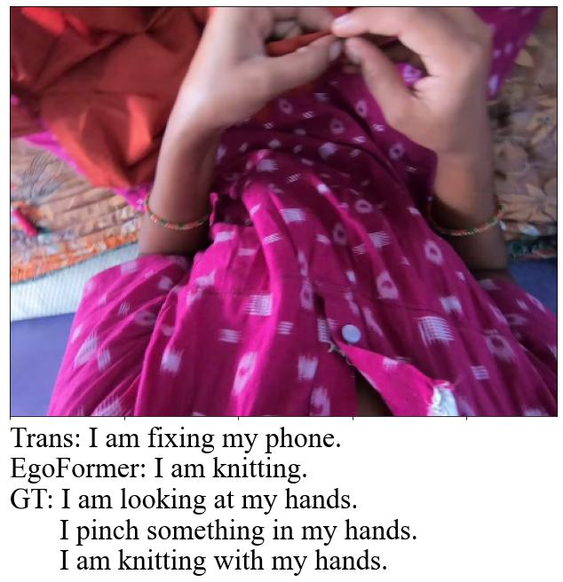

EgoCap and EgoFormer: First-Person Image Captioning
========

## EgoCap Dataset ##

EgoCap is a first sizable dataset that supports end-to-end egocentric image captioning. It contain 2.1K egocentric images, over 10K captions, and 6.3K contextual
label.

The EgoCap dataset can be downloaded from [here](https://drive.google.com/drive/folders/10u8kBlrqi9sFiXZrouP6FChypen4dcFz?usp=sharing).

## EgoFormer ##

EgoFormer is a two-stream transformer based deep neural network utilizing visual-contextual attention for image caption generation in 1st-person narrative. EgoFormer accomplishes accurate and human-alike scene understanding with the aid of context encoding. You can run EgoFormer on a Jetson Nano device to let robot explore the uncharted on your behalf. A video demo can be seen **here**.

Please cite our paper as belew;

```
@inproceedings{egocap2022,
author = {Dai, Zhuangzhuang and Tran, Vu and Markham, Andrew and Trigoni, Niki and Rahman, M Arif and Wijayasingha, L. N. S. and Stankovic, John and Li, Chen},
year = {2022},
month = {},
pages = {},
booktitle={Proceedings of the British Machine Vision Conference (BMVC)},
publisher={BMVA Press},
title = {EgoCap and EgoFormer: First-Person Image Captioning with Context Fusion}
}
```

This repository implements the training and evaluation of EgoFormer. It is modified based on repository [CATR](https://github.com/saahiluppal/catr).

## Prerequisites ##

* Python 3.7
* Pytorch 1.7
* torchvision 0.8.2
* transformers 4.12.5
* pycocoevalcap
* sklearn

Microsoft [COCO-2017](http://cocodataset.org/#download) dataset and EgoCap dataset are required. After acquiring these datasets locally, specify source directory links, training settings, and hyperparameters in *configuration.py*.

## Usage ##

Use the following commands context learning, and EgoFormer training;

```python
python3 vit_pretrain.py  # Pre-train ViT context encoder, if needed
python3 main.py
```

At deployment stage, e.g., on an NVIDIA Jetson Nano, put the EgoFormer model under root directory and simply run;

```bash
./egobot_talk.sh
```

## Evaluation ##

It is recommended to run the evaluation pipeline through the **notebook**. Otherwise, use *predict.py* to generate caption of an arbitrary image, or use APIs in *Eval.py* to conduct quantitative analysis.

Some qualitative analysis results are shown below

<p align="center">
  
  
  
</p>

## Acknowledge ##

Thank the support of the National Institute of Standards and Technology (NIST) in Pervasive, Accurate, and Reliable Location-based Services for Emergency Responders.

Thank Professor Bongjun Choi's team of Dongseo University for helping with data validation.
