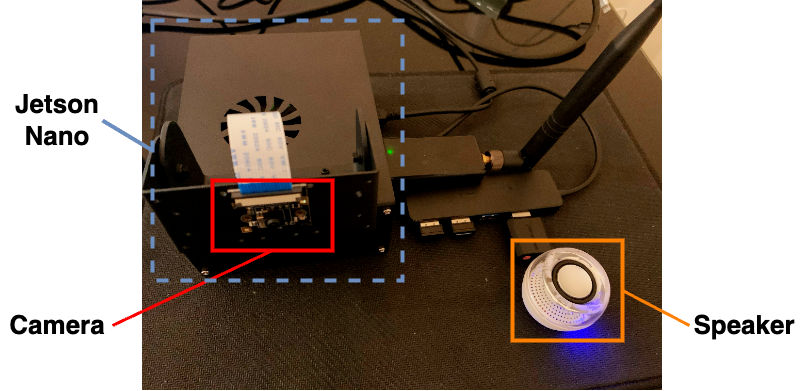
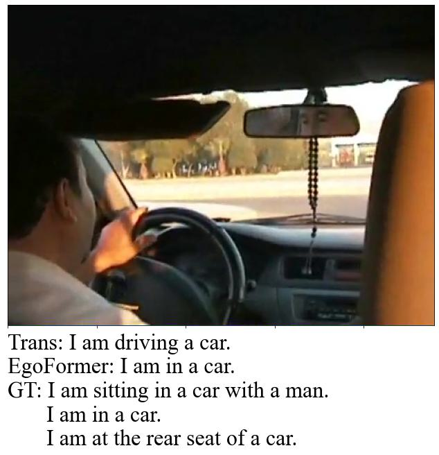
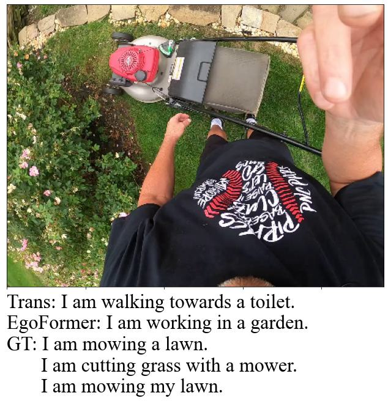
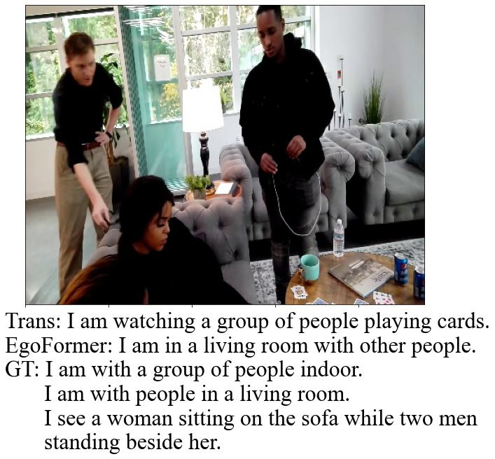

EgoCap and EgoFormer: First-Person Image Captioning
========

## EgoCap Dataset ##

EgoCap is a first sizable dataset that supports end-to-end egocentric image captioning. It contain 2.1K egocentric images, over 10K captions, and 6.3K contextual
label.

The EgoCap dataset can be downloaded from *public drive* if you contact z.dai1@aston.ac.uk for access. Please state your name, affiliation, and purpose of use in the email.

## EgoFormer ##

EgoFormer is a two-stream transformer based deep neural network utilizing visual-contextual attention for image caption generation in a 1st-person narrative. EgoFormer accomplishes accurate and human-alike scene understanding with the aid of context encoding. The context encoder is a pre-trained ViT encoder, which is subsequently fine-tuned on EgoCap context classfication, namely *where*, *when*, and *whom*.

Please cite our paper as belew;

```
@inproceedings{dai_egocap2022,
author = {Dai, Zhuangzhuang and Tran, Vu and Markham, Andrew and Trigoni, Niki and Rahman, M Arif and Wijayasingha, L. N. S. and Stankovic, John and Li, Chen},
year = {2022},
month = {},
pages = {},
booktitle={arXiv},
publisher={arXiv},
title = {EgoCap and EgoFormer: First-Person Image Captioning with Context Fusion}
}
```

## Prerequisites ##

* Python 3.7
* Pytorch 1.7
* torchvision 0.8
* transformers
* pycocoevalcap
* aac-metrics
* sklearn

Microsoft [COCO-2017](http://cocodataset.org/#download) dataset and EgoCap dataset are required. After acquiring these datasets locally, specify source directory links, training settings, and hyperparameters in *configuration.py*.

## Training ##

This repository implements the training and evaluation of EgoFormer. It is modified based on repository [CATR](https://github.com/saahiluppal/catr).

Make sure you train the baseline with COCO first (configure **self.modality** as "image"). Then use the following command for context learning;

```bash
python3 vit_pretrain.py  # Pre-train ViT context encoder
```

Finally use the following command to train EgoFormer with updated link to converged context ViT model;

```bash
python3 main.py
```

## Deployment on NVIDIA Jetson Nano ##

<p align="center">
  
</p>

You can run EgoFormer on an embedded device to let robot explain the scene for you. We implemented an EgoBot on NVIDIA Jetson Nano with a CSI camera, a speaker, Wi-Fi dongle, and a power bank. Please check out our [Video Demo](https://youtu.be/tvPZzB8Ufz8).

To deploy the EgoFormer inference engine onto Jetson Nano, you will need *soundcard*, *audio2numpy*, and *gtts* packages to run the camera driver, inference engine, and the speaker. To let EgoBot speak out loud, run

```bash
python3 egobot_shoot.py &
python3 egobot_speak.py
```

## Evaluation ##

It is recommended to perform evaluation through the *Inference_and_Analysis.ipynb*. Otherwise, use **predict_qualitative()** in *Eval.py* to generate caption of an image, or conduct quantitative analysis on a directory of images.

Some EgoFormer caption results in comparison to baseline transformer are shown below

<p align="center">
  
  
  
</p>

## Acknowledge ##

We thank the support of the National Institute of Standards and Technology (NIST) in project: Pervasive, Accurate, and Reliable Location-based Services for Emergency Responders.

We thank Professor Bongjun Choi's team of Dongseo University for helping with data validation.
